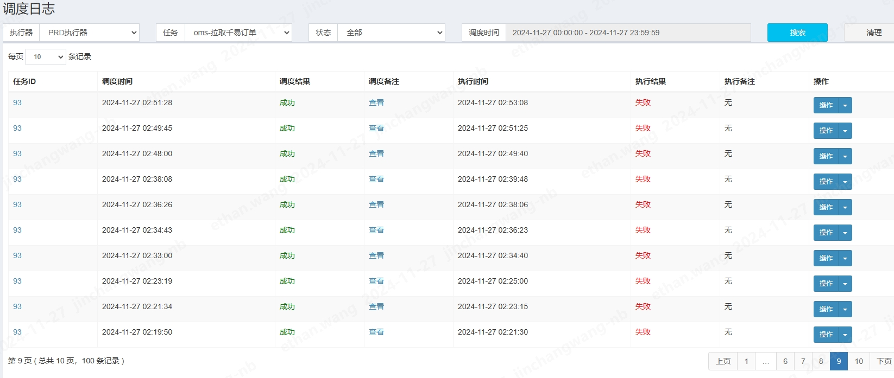
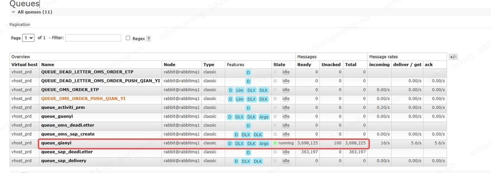
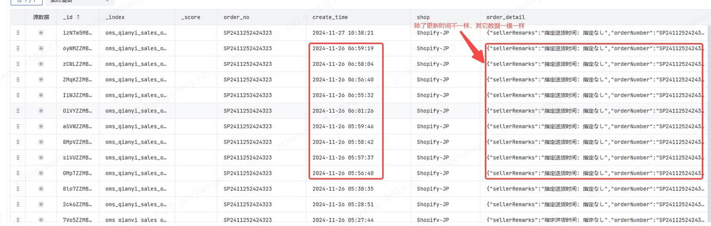

一、现象
2024年11月26日早上，业务反馈千易平台一些单状态未更新、一些单没有拉过来。


二、原因
（1）定时任务执行失败
千易订单同步是通过定时任务每隔15分钟拉取一次同步的，24日-26日频繁收到定时任务执行失败提醒，定时任务失败会重试3次，如果3次都执行失败，那么这段时间就不会执行拉单，但是下一次定时任务执行会使用上次失败调用接口的时间作为开始时间，所以定时任务产生漏单的可能性较小。


（2）消息队列消息堆积
由于近期大促，千易订单激增，订单消息生成的速度远大于消费者消费的速度，导致消息堆积达三百万多条，订单信息无法及时更新。


（3）千易数据重复更新
同一个千易订单在一段时间内不到一分钟千易更新时间就更新一次，但数据其实是一样的，这样就导致重复的数据堆积到消息队列，会影响到其它单的处理。


（4）分页漏单问题
因为千易订单更新时间频繁，导致查询下页的时候还是能查到这个单，而这个单又占据了原来在本页的位置，即将原本在本页的位置的单顶到上一页去了，这样就会导致漏单。


三、解决方案
（1）定时任务执行失败
排查定时任务执行失败原因

（2）消息队列消息堆积
增加消费者服务节点：ecoflow-amqp节点由一台更新为两台；
增加订单处理服务节点：ecoflow-oms节点由两台更新为四台；
增加节点后可以发现消费速度有了明显的提升。

（3）千易数据重复更新
千易订单很多报文除更新时间外，其它数据是一样的，针对这类数据，将报文更新时间重置，对整个报文进行md5加密，如果数据完成一样，那么md5值就一样，对于md5值一样的订单，不需要进行再次处理。
```
/**
* 发布订单到消息队列，如果报文一样（除更新时间外）则不重复发布
*
* @param orderJson
*/
private void publishOrder(JSONObject orderJson) {
  JSONObject newJson = new JSONObject(orderJson);
  String orderNumber = orderJson.getString("orderNumber");
  try {
      newJson.put("updateTime", 0);
  
       String md5Str = MD5Utils.md5Hex(newJson.toJSONString(), "UTF-8");
       boolean exist = redisUtil.setIfAbsent(BizConstant.QIANYI_ORDER_BASE + orderNumber + ":" + md5Str, md5Str, 2, TimeUnit.HOURS);
       if (exist) {
           log.info("publishOrder orderNo:{}", orderNumber);
           OrderSupport.publishOrder(qianyiKey, orderJson);
       }
  } catch (Exception e) {
      log.error("QianyiService#publishOrder error", e);
      sendException.send(String.format("QianyiService#publishOrder orderNo:%s\nerror:%s\ntraceId:%s", orderNumber, e.getMessage(), ContextHolder.getTraceId()));
  }
}

```

（4）分页漏单问题
  已向千易反馈，千易提供按时间段查询此段时间所有订单号的接口，然后通过单号进行再次补偿拉单。


四、注意事项
（1）消费者服务默认10个消费者